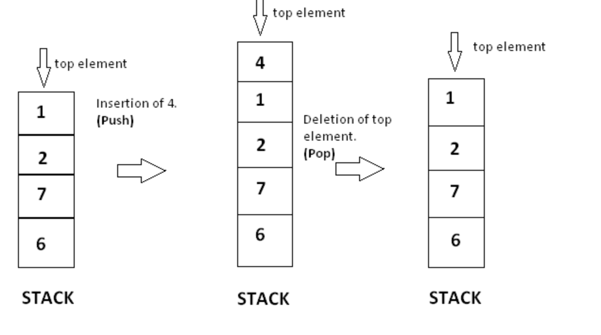
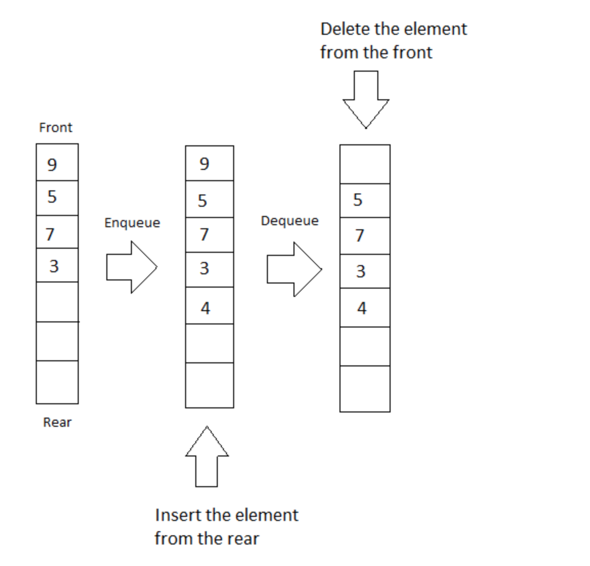

# Lab 7: Stacks and Queues

Welcome to Lab 7! In this lab we will write the classes for a hotel guest manager. These classes will implement two different data structures: a stack and a queue. We will also work with the API class LocalDateTime, which will allow our program to store the times when guests check in and out of the hotel. Let's get started!

# Stacks
A stack is a collection of elements that are added and removed in LIFO order. LIFO stands for "Last In First Out," which means the element added most recently will be removed first. Imagine a stack of trays on a table. When you add a tray, you put it at the top; when you remove a tray, you remove it from the top. Adding is also called "pushing," and removing is also called "popping."

# Queues
A queue is a collection of elements that are added and removed in FIFO order. FIFO stands for "First In First Out," which means the element that has been in the queue the longest will be the first removed. Imagine a line of people waiting at a bus stop. The person who enters the line first will be the first to enter the bus. Adding an element is also called "enqueuing," and removing an element is also called "dequeuing."

# Lab Instructions
Complete the classes Guest, Hotel, StackHotel, and QueueHotel.
Hotel is an abstract class.
StackHotel and QueueHotel are concrete classes that extend Hotel.
As their names suggest, StackHotel uses a stack to store Guest objects, and QueueHotel uses a queue.
A finished Driver class is provided that you can use to test the other classes.

# Guest Class
This class represents a single guest staying at a hotel. 
Each Guest has three fields: a name, check-in time, and room number.
The check-in time is stored as a [LocalDateTime](https://docs.oracle.com/javase/8/docs/api/java/time/LocalDateTime.html) object.
  
# Hotel Class
This class represents a hotel. It has a number of abstract methods that are implemented by the subclasses StackHotel and QueueHotel.
The class includes a static reference to a [DateTimeFormatter](https://docs.oracle.com/javase/8/docs/api/java/time/format/DateTimeFormatter.html) object.
This object can be passed as an argument to the format method of a LocalDateTime object, which produces a String representation of a date and time in a particular format.
 
# StackHotel Class
This class extends Hotel and stores Guests in a stack.
The addGuest method pushes a Guest on the top of the stack.
The checkOut method pops a Guest from the top of the stack.
Guests are thus added and removed in LIFO order.
 
# QueueHotel Class
This class extends Hotel and stores Guests in a queue.
The addGuest method enqueues a Guest at the tail (back) of the queue.
The checkOut method dequeues a Guest from the head (front) of the queue.
Guests are thus added and removed in FIFO order.
